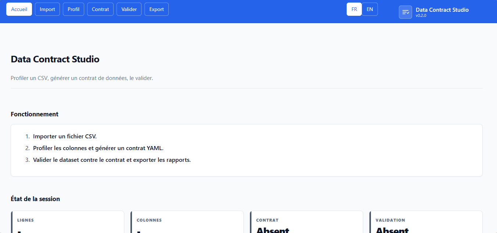

# 📜 Data Contract Studio

[Français](README.fr.md) | English

Data Contract Studio est une application qui profile un dataset CSV, génère un **contrat de données** structuré (YAML/JSON) décrivant ses attentes qualité, puis valide le dataset contre ce contrat. L'outil est conçu pour accompagner les démarches de gouvernance des données ; le contrat généré et le rapport de validation sont des aides à la décision et ne certifient ni l'exactitude, ni l'exhaustivité, ni l'aptitude à un usage en production.




## Sommaire

- [Fonctionnalités](#fonctionnalités)
- [Lancer localement](#lancer-localement)
- [Démonstration en ligne](#démonstration-en-ligne)
- [Docker](#docker)
- [Utiliser l'application](#utiliser-lapplication)
- [Comment ça marche](#comment-ça-marche)
- [Gestion des données et limites](#gestion-des-données-et-limites)
- [Configuration](#configuration)
- [Structure du projet](#structure-du-projet)
- [Licence](#licence)
- [Auteur](#auteur)

## Fonctionnalités

- Import de fichiers CSV avec détection automatique de l'encodage et du délimiteur.
- Profilage de chaque colonne : type logique inféré, statistiques descriptives (min, max, moyenne, médiane, percentiles), taux de valeurs nulles et nombre de valeurs distinctes.
- Détection automatique des candidats clés uniques et clés primaires.
- Reconnaissance des patterns dominants (emails, numéros de téléphone, dates ISO, codes postaux, UUID, URLs) via des heuristiques regex.
- Génération d'un contrat de données structuré au format YAML, avec export JSON.
- Édition manuelle du contrat avant validation, dans un éditeur YAML (ajout ou ajustement de règles).
- Validation du dataset contre le contrat et production d'un rapport par règle (réussite/échec) avec nombre de violations et exemples de valeurs fautives.
- Expression de règles métier simples (valeurs autorisées, patterns regex, dépendances conditionnelles) et de contraintes référentielles contre des listes de référence (ex. codes pays ISO).
- Export du contrat final et du rapport de validation au format YAML, JSON, Markdown ou HTML.
- Bascule de l'interface entre français et anglais.
- Persistance locale de la session de travail et restauration au redémarrage.

## Lancer localement

Sous Windows PowerShell :

```powershell
py -3.11 -m venv .venv
.\.venv\Scripts\Activate.ps1
python -m pip install -r requirements.txt
streamlit run app.py
```

Sous macOS ou Linux :

```bash
python3 -m venv .venv
. .venv/bin/activate
python -m pip install -r requirements.txt
streamlit run app.py
```

Exécuter la suite de tests avant tout commit :

```bash
python -m pytest -q
```

## Démonstration en ligne

Essayer l'application en ligne :
<p align="left">
  <a href="https://data-contract.streamlit.app/" target="_blank">
    
  </a>
</p>

## Docker

Construire et exécuter l'image Docker :

```bash
docker build -t data-contract-studio .
docker run --rm -p 8501:8501 data-contract-studio
```

L'image embarque un healthcheck conteneur visant l'endpoint de santé Streamlit.

## Utiliser l'application

1. Ouvrir **Accueil** pour consulter l'état de la session courante.
2. Ouvrir **Import**, téléverser un fichier CSV et régler les options de profilage (lignes max, seuil de catégorie, unification des valeurs nulles).
3. Ouvrir **Profil** pour examiner les types inférés, les statistiques, les taux de valeurs nulles, les candidats clés, les patterns détectés et l'aperçu du contrat généré.
4. Ouvrir **Contrat** pour éditer manuellement le contrat YAML, puis l'enregistrer ou le régénérer depuis le profil.
5. Ouvrir **Valider** pour exécuter les tests du contrat contre le dataset et lire le rapport par règle.
6. Ouvrir **Export** pour télécharger le contrat final (YAML/JSON) et le rapport de validation (JSON/Markdown/HTML).

Utiliser **Réinitialiser** sur la page Import pour effacer le dataset, le contrat et le rapport de la session. Le téléversement est limité à 200 Mo par `.streamlit/config.toml` ; les fichiers dépassant le *max rows* configuré sont tronqués à la lecture, et le profil ne décrit alors que les lignes conservées.

## Comment ça marche

- **Profilage.** Pour chaque colonne, le moteur normalise les tokens nuls, infère un type logique (`integer`, `float`, `boolean`, `string`, `date`, `datetime`, `categorical`), calcule les statistiques descriptives sur les colonnes numériques et temporelles, mesure le taux de valeurs nulles, compte les valeurs distinctes et signale les candidats clés uniques / primaires. Un détecteur de patterns échantillonne les valeurs et les confronte à des regex connues ; un pattern dominant (≥ 80 % de correspondance) est enregistré et peut devenir une règle du contrat. Les colonnes texte à faible cardinalité (au plus un seuil configurable) sont collectées comme ensembles de valeurs autorisées candidates.
- **Génération du contrat.** Le profil est traduit en contrat YAML : colonnes ordonnées avec types, indicateurs obligatoire/nul, unicité et clé primaire, bornes min/max numériques, bornes de longueur texte, patterns détectés, valeurs autorisées et seuils de valeurs nulles, auxquels s'ajoutent des listes vides de règles métier et de contraintes référentielles à compléter manuellement. Le contrat est un YAML valide et se convertit sans perte en JSON.
- **Validation.** Le validateur exécute chaque règle du contrat contre le dataset et émet un résultat par règle avec un statut (`pass`/`fail`/`warning`), un nombre de violations et des exemples de valeurs fautives. Familles de règles couvertes dans le MVP : existence de colonne, compatibilité de type, obligatoire / seuil de valeurs nulles, unicité / clé primaire, plage numérique, longueur texte, pattern regex, valeurs autorisées, appartenance à une liste de référence, et règles métier conditionnelles. Le rapport agrège un score égal à `réussies / (réussies + échouées)`.
- **Nature heuristique.** L'inférence de type, la détection de patterns et les suggestions de clés / valeurs autorisées sont des heuristiques statistiques dérivées de l'échantillon téléversé. Elles proposent un contrat *de départ*, non garanti : relire et éditer le contrat avant de considérer les résultats de validation comme faisant foi.

## Gestion des données et limites

- Le dataset analysé, le profil, le contrat et le rapport sont conservés en mémoire du processus de la session Streamlit courante. L'application écrit en outre un instantané local dans `.streamlit/session_state.json` (ignoré par git) afin de restaurer la session au redémarrage ; utiliser **Réinitialiser** sur la page Import pour l'effacer. Ce fichier local n'est pas une base de données et n'est pas partagé entre utilisateurs.
- Sur un déploiement hébergé, les fichiers téléversés sont transmis au serveur exécutant Streamlit et sont soumis aux contrôles d'accès, journaux, sauvegardes et politiques de rétention de cet hôte. Ne pas téléverser de données confidentielles ou réglementées sur une instance publique dont le déploiement n'aurait pas été examiné et approuvé à cet usage.
- La validation contrôle le dataset contre les règles présentes dans le contrat. Elle n'infère pas d'intention métier manquante : un rapport réussi signifie que les données correspondent au contrat *que vous avez édité*, non que ce contrat est correct ou complet. Les patterns détectés et les bornes inférées sont heuristiques et peuvent produire des faux positifs ou des faux négatifs.
- L'outil cible des contrats mono-fichier CSV dans le MVP. L'intégrité référentielle multi-tables, les règles temporelles et les registres de référence externes sont hors périmètre.

## Configuration

| Paramètre | Défaut | Rôle |
| --- | --- | --- |
| Lignes max (Import) | 200000 | Nombre maximal de lignes de données lues et profilées ; les fichiers plus volumineux sont tronqués. |
| Seuil de catégorie (Import) | 50 | Nombre maximal de valeurs distinctes pour qu'une colonne à faible cardinalité soit proposée comme ensemble de valeurs autorisées. |
| Unifier les valeurs nulles (Import) | activé | Traiter les chaînes vides et les tokens tels que `na`, `n/a`, `null`, `none`, `nan`, `nil`, `-` comme des valeurs nulles pendant le profilage et la validation. |
| server.maxUploadSize | 200 Mo | Limite de téléversement Streamlit dans `.streamlit/config.toml`. |
| VERSION | 0.0.0 | Fichier de version sémantique à la racine du dépôt, lu au démarrage et affiché dans la barre latérale ; maintenu automatiquement par le workflow Version. |

## Structure du projet

| Chemin | Rôle |
| --- | --- |
| app.py | Point d'entrée Streamlit et workflows des pages. |
| VERSION | Version sémantique, lue au démarrage, maintenue par le workflow Version. |
| requirements.txt | Dépendances Python. |
| .streamlit/config.toml | Configuration du thème et du serveur Streamlit. |
| core/io.py | Lecture CSV avec détection d'encodage et de délimiteur. |
| core/profiler.py | Profilage automatique des colonnes et détection de clés/patterns. |
| core/patterns.py | Détection de patterns regex. |
| core/contract.py | Génération du contrat, sérialisation YAML/JSON, validation structurelle. |
| core/validator.py | Exécution des tests du contrat et rapport de violations. |
| core/session_store.py | Persistance et restauration locales de la session. |
| ui/theme.py | Chargement du CSS. |
| ui/nav.py | Barre latérale et navigation supérieure. |
| ui/components.py | Composants UI réutilisables (cartes, grille KPI, boîtes de statut). |
| ui/i18n.py | Catalogues de messages français et anglais. |
| assets/styles.css | Thème de l'application. |
| assets/report.css | Habillage des rapports HTML exportés. |
| report/builder.py | Construction du payload du rapport de validation. |
| report/exporters.py | Export Markdown, JSON et HTML. |
| tests/ | Suite de tests unitaires et d'intégration. |
| .github/workflows/version.yml | Tests CI et versioning sémantique / publication automatique. |
| Dockerfile | Configuration conteneur avec healthcheck. |
| LICENSE | Termes de la licence MIT. |

## Licence

Ce projet est sous licence MIT. Voir [LICENSE](LICENSE) pour les termes complets.

## Auteur

Maxime NDACLEU - Data Analyst & BI


