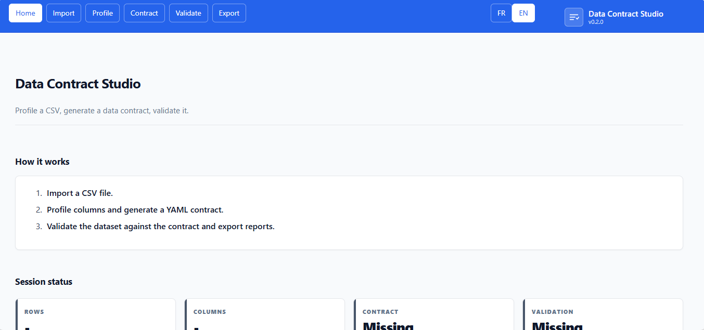

# 📜 Data Contract Studio

English | [Français](README.fr.md)

Data Contract Studio is an application that profiles a CSV dataset, generates a structured **data contract** (YAML/JSON) describing its quality expectations, and validates the dataset against that contract. It is intended to support data-governance workflows; the generated contract and the validation report are decision-support artifacts and do not certify correctness, completeness, or fitness for production use.




## Contents

- [Capabilities](#capabilities)
- [Run locally](#run-locally)
- [Live Demo](#live-demo)
- [Docker](#docker)
- [Use the application](#use-the-application)
- [How it works](#how-it-works)
- [Data handling and limitations](#data-handling-and-limitations)
- [Configuration](#configuration)
- [Project structure](#project-structure)
- [License](#license)
- [Author](#author)

## Capabilities

- Import CSV files with automatic encoding and delimiter detection.
- Profile every column: inferred logical type, descriptive statistics (min, max, mean, median, percentiles), null rate, and distinct count.
- Detect unique-key and primary-key candidates automatically.
- Recognize dominant content patterns (emails, phone numbers, ISO dates, postal codes, UUIDs, URLs) through regex heuristics.
- Generate a structured data contract in YAML, with JSON export.
- Edit the contract manually before validation, in a YAML editor (add or adjust rules).
- Validate the dataset against the contract and produce a per-rule pass/fail report with violation counts and sample offending values.
- Express simple business rules (allowed values, regex patterns, conditional-required dependencies) and referential constraints against reference lists (e.g. ISO country codes).
- Export the final contract and the validation report as YAML, JSON, Markdown, or HTML.
- Switch the interface between French and English.
- Persist the working session locally and restore it on restart.

## Run locally

On Windows PowerShell:

```powershell
py -3.11 -m venv .venv
.\.venv\Scripts\Activate.ps1
python -m pip install -r requirements.txt
streamlit run app.py
```

On macOS or Linux:

```bash
python3 -m venv .venv
. .venv/bin/activate
python -m pip install -r requirements.txt
streamlit run app.py
```

Run the test suite before committing:

```bash
python -m pytest -q
```

## Live Demo

Try the app online:
<p align="left">
  <a href="https://data-contract.streamlit.app/" target="_blank">
    
  </a>
</p>

## Docker

Build and run the Docker image:

```bash
docker build -t data-contract-studio .
docker run --rm -p 8501:8501 data-contract-studio
```

The image ships a container healthcheck against the Streamlit health endpoint.

## Use the application

1. Open **Home** to see the current session status.
2. Open **Import**, upload a CSV file, and tune the profiling options (max rows, category threshold, null-like unification).
3. Open **Profile** to review inferred types, statistics, null rates, key candidates, detected patterns, and the generated contract preview.
4. Open **Contract** to edit the YAML contract manually, then save it or regenerate it from the profile.
5. Open **Validate** to run the contract tests against the dataset and read the per-rule report.
6. Open **Export** to download the final contract (YAML/JSON) and the validation report (JSON/Markdown/HTML).

Use **Reset** on the Import page to clear the current dataset, contract, and report from the session. The upload widget is limited to 200 MB by `.streamlit/config.toml`; files larger than the configured *max rows* are truncated during reading, and the profile then describes the retained rows only.

## How it works

- **Profiling.** For each column the engine normalizes null-like tokens, infers a logical type (`integer`, `float`, `boolean`, `string`, `date`, `datetime`, `categorical`), computes descriptive statistics on numeric and date columns, measures the null rate, counts distinct values, and flags unique/primary-key candidates. A pattern detector samples values and matches them against known regexes; a dominant pattern (≥ 80% match) is recorded and can become a contract rule. Low-cardinality string columns (at or below a configurable threshold) are collected as candidate allowed-value sets.
- **Contract generation.** The profile is translated into a YAML contract: ordered columns with types, required/nullable flags, uniqueness and primary-key markers, numeric min/max bounds, string length bounds, detected patterns, allowed values, and null-rate thresholds, plus empty lists for business rules and referential constraints to be completed manually. The contract is valid YAML and round-trips to JSON.
- **Validation.** The validator executes each contract rule against the dataset and emits one result per rule with a status (`pass`/`fail`/`warning`), a violation count, and sample offending values. Rule families covered in the MVP: column existence, type compatibility, required / null-threshold, uniqueness / primary-key, numeric range, string length, regex pattern, allowed values, referential list membership, and conditional-required business rules. The report aggregates a score equal to `passed / (passed + failed)`.
- **Heuristic nature.** Type inference, pattern detection, and key / allowed-value suggestions are statistical heuristics derived from the uploaded sample. They propose a *starting* contract, not a guaranteed one: always review and edit the contract before treating validation results as authoritative.

## Data handling and limitations

- The parsed dataset, profile, contract, and report are held in the current Streamlit session's process memory. The application additionally writes a local snapshot to `.streamlit/session_state.json` (git-ignored) so the session can be restored on restart; use **Reset** on the Import page to clear it. This local file is not a database and is not shared between users.
- On a hosted deployment, uploaded files are sent to the server running Streamlit and are subject to that host's access controls, logs, backups, and retention policies. Do not upload confidential or regulated data to a public instance unless the deployment has been reviewed and approved for that use.
- Validation checks the dataset against the rules present in the contract. It does not infer missing business intent: a passing report means the data matches the contract *you edited*, not that the contract is correct or complete. Detected patterns and inferred bounds are heuristics and can produce false positives or false negatives.
- The tool targets single-file CSV contracts in the MVP. Multi-table referential integrity, temporal rules, and external reference registries are out of scope.

## Configuration

| Setting | Default | Purpose |
| --- | --- | --- |
| Max rows (Import) | 200000 | Maximum data rows read and profiled; larger files are truncated. |
| Category threshold (Import) | 50 | Maximum distinct values for a low-cardinality column to be proposed as an allowed-value set. |
| Unify null-like values (Import) | on | Treat empty strings and tokens such as `na`, `n/a`, `null`, `none`, `nan`, `nil`, `-` as nulls during profiling and validation. |
| server.maxUploadSize | 200 MB | Streamlit upload limit in `.streamlit/config.toml`. |
| VERSION | 0.0.0 | Semantic version file at the repo root, read at startup and shown in the sidebar; maintained automatically by the Version workflow. |

## Project structure

| Path | Purpose |
| --- | --- |
| app.py | Streamlit entry point and page workflows. |
| VERSION | Semantic version, read at startup, maintained by the Version workflow. |
| requirements.txt | Python dependencies. |
| .streamlit/config.toml | Streamlit theme and server configuration. |
| core/io.py | CSV reading with encoding and delimiter detection. |
| core/profiler.py | Automatic column profiling and key/pattern detection. |
| core/patterns.py | Regex pattern detection. |
| core/contract.py | Contract generation, YAML/JSON serialization, structural validation. |
| core/validator.py | Execution of contract tests and violation reporting. |
| core/session_store.py | Local session persistence and restore. |
| ui/theme.py | CSS loading. |
| ui/nav.py | Sidebar and top navigation. |
| ui/components.py | Reusable UI components (cards, KPI grid, status boxes). |
| ui/i18n.py | French and English message catalogs. |
| assets/styles.css | Application theme. |
| assets/report.css | Styling for exported HTML reports. |
| report/builder.py | Validation report payload construction. |
| report/exporters.py | Markdown, JSON, and HTML export. |
| tests/ | Unit and integration test suite. |
| .github/workflows/version.yml | CI tests and automatic semantic versioning / release. |
| Dockerfile | Container configuration with healthcheck. |
| LICENSE | MIT license terms. |

## License

This project is licensed under the MIT License. See [LICENSE](LICENSE) for the full terms.

## Author

Maxime NDACLEU - Data Analyst & BI


